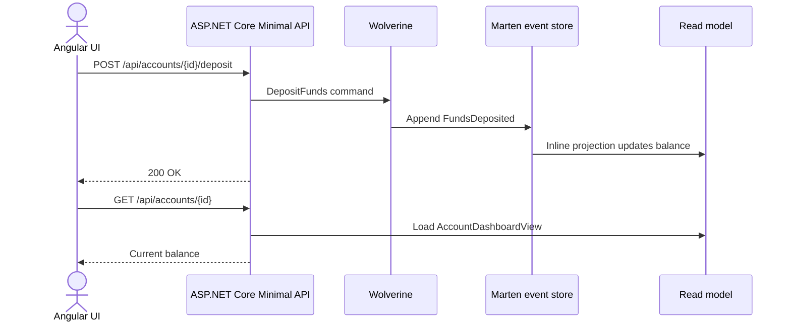

# EventSourcedLedger

A small financial ledger built with event sourcing and CQRS. It's my way of learning what changes when you store *what happened* instead of *the current state*.

## Why
In a normal CRUD app every `UPDATE` overwrites history. Accounting, which is my day job, cares a lot about history. In this project every business action is stored as an immutable event in an append-only stream, and the current balance is derived from those events.

## How it works
**Write side (commands)**
- HTTP POSTs map to plain C# `record` commands, dispatched with **Wolverine**.
- Handlers turn commands into domain events (e.g. `FundsDeposited`), and **Marten** appends them to a PostgreSQL (JSONB) event stream. State is never updated in place.

**Read side (queries)**
- A Marten **inline projection** updates a flat read model (`AccountDashboardView`) in the same transaction as the event append.
- The Angular client reads that pre-built view with simple GET requests and never touches the event stream.

## Stack
.NET 9 · ASP.NET Core Minimal APIs · Wolverine · Marten · PostgreSQL 16 (Docker) · Angular 18 (standalone)

## Decisions
1. **Marten instead of EventStoreDB or Kafka.** I already run PostgreSQL. Marten gives me an event store and projections on top of it without another piece of infrastructure.
2. **Wolverine instead of MediatR.** Handlers can be plain functions with less ceremony, and Wolverine has an outbox if I need one later.
3. **Inline projections for now.** The read model updates in the same transaction, so reads are immediately consistent. If write volume grows, Marten can switch to async projections (eventual consistency) with a config change.

## Run it locally
Prerequisites: .NET 9 SDK, Node.js + Angular CLI, Docker.
1. Start PostgreSQL: `docker-compose up -d`
2. Run the API: `cd EventSourcedLedger.Api && dotnet run`
3. Run the client: `cd Frontend/event-ledger-ui && npm install && ng serve`
4. Open `http://localhost:4200`.

## What's next
- More account events (withdrawals, transfers between accounts) and the business rules around them
- Rebuilding a projection from scratch to show replay
- Tests for the aggregate and the projection

---

Built by Jovan Madzic, Software Engineer in Belgrade · [LinkedIn](https://www.linkedin.com/in/jovan-madzic-12093b202/) · [GitHub](https://github.com/ckejoM)
